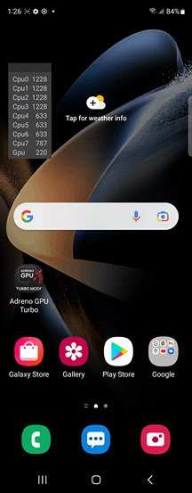

# AdrenoGPU-Turbo-Mode

This application activates Turbo mode on Adreno GPUs, which can lock the maximum GPU frequency

Example on Samsung Galaxy Z Fold4:

# You should be aware of the following

1. Turbo mode only works on Adreno GPUs.

2. The application does not require ADB or ROOT access.

3. Locking the maximum GPU frequency may increase device heating ⚠️

4. Turbo mode may not work on all devices.

5. On some devices, Turbo mode may turn off if the GPU is not under load. In this case, enable Turbo through the floating window while the game is running.

6. On some devices, if Turbo is enabled, after locking the screen the GPU may get stuck at a low frequency. To fix this, restart the device.

## Third party applications

[libadrenotools](https://github.com/bylaws/libadrenotools/).
