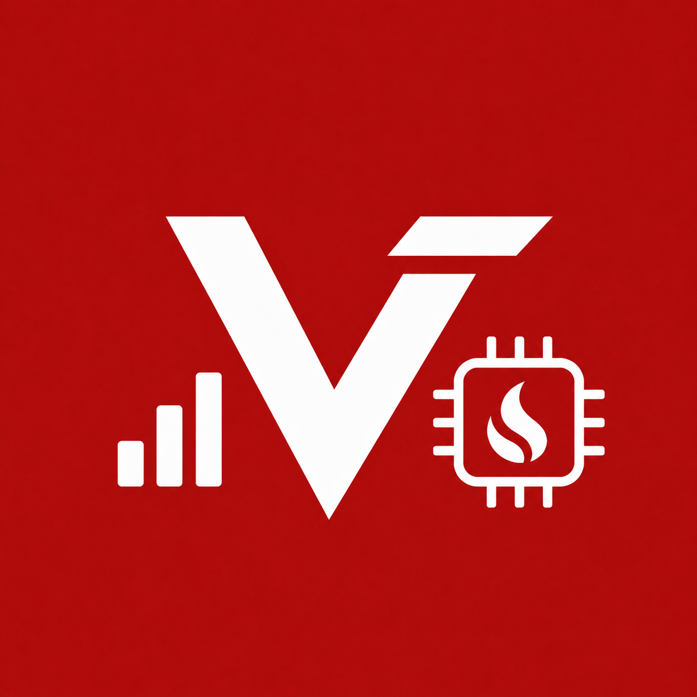
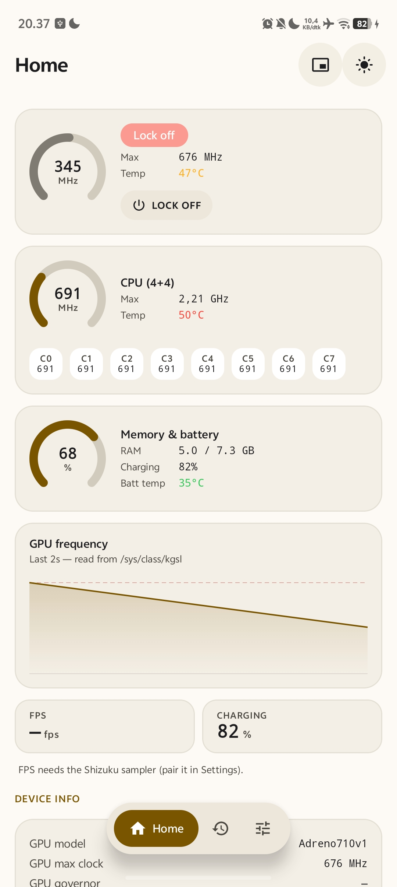
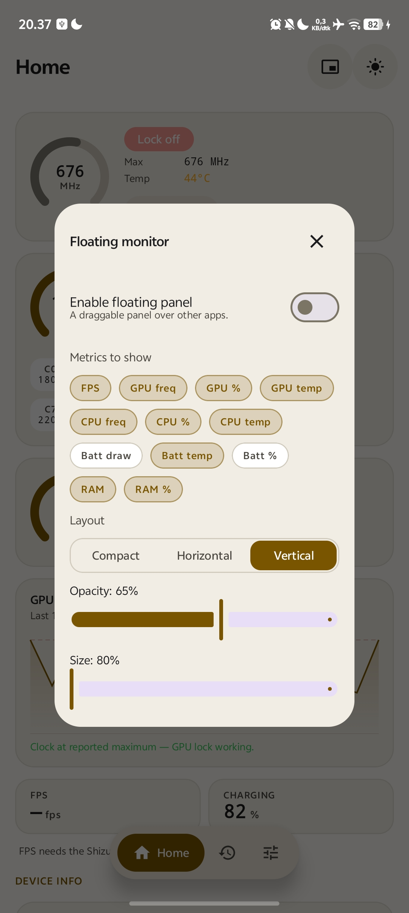

# VZtats

**A no-root performance monitor for Android — with an Adreno GPU clock lock built in.**

---

> [!WARNING]
> **This is an early pre-release (v0.2).**
> VZtats is not feature-complete and **bugs are expected**. Some monitors are still
> missing, some readings are approximations, and the UI is still changing between
> releases. Use it as a preview, not as a daily-driver tool you rely on.
> Please [open an issue](https://github.com/Vauzi-17/vztats/issues) if
> something breaks on your device — device-specific reports are especially useful.

## What it is

VZtats shows what your phone's hardware is actually doing — GPU, CPU, RAM, battery
and FPS — live, in the app and in a floating overlay you can keep on top of a game.
No root required.

It started as a fork of [AdrenoGPU-Turbo-Mode](https://github.com/Fartopblu/AdrenoGPU-Turbo-Mode)
(a single-purpose Adreno clock locker) and grew into a general monitor. The GPU
lock is still here — it's now one feature among several rather than the whole app.

## Screenshots

| Home | Floating monitor |
|:---:|:---:|
|  |  |
| GPU, per-core CPU, memory & battery, frequency graph | Pick metrics, layout, opacity and size |

## Features

**Live monitoring**
- GPU: current / max clock, clock % of max, temperature, GPU model, and driver-reported
  load where the kernel exposes it (`gpu_busy_percentage` / `gpubusy`)
- GPU frequency graph with 30 s / 1 min / 5 min windows and now / average / peak readouts
- CPU: current/max clock, clock %, temperature, and **per-core clocks** with cluster
  detection from the kernel's cpufreq policies (e.g. `4+4`, `3+2+2+1`)
- Memory & battery: RAM used/available/total, battery level, charge state and charger
  type, temperature, current, voltage, and power (voltage × current) — each shown only
  when the platform reports it
- FPS: real per-game frame rate via Shizuku (optional)
- Device info: GPU model/governor, CPU topology, Android version, kernel, device model

**Floating overlay**
- Three layouts — compact pill, horizontal bar, vertical panel
- Pick exactly which metrics appear, including percent variants (GPU clock %, CPU clock %, RAM %)
- Adjustable opacity and size, draggable anywhere
- Follows the app's theme, including dark mode and Material You
- Built-in GPU Lock toggle and a "free background RAM" action

**Session recording**
- Record a play session and save a summary: peak GPU clock, peak temperatures,
  average/minimum FPS, and an estimated throttling percentage

**GPU Lock** (Adreno / Qualcomm only)
- Pins the GPU to its maximum clock by disabling the KGSL driver's dynamic clock
  scaling (DCVS) — **no root, no ADB**
- Reports whether the kernel actually accepted the request instead of assuming it worked
- Quick Settings tile for toggling without opening the app
- Keep-alive service that re-applies the lock after the screen unlocks
- Optional auto-safety: release the lock above a temperature limit or below a battery floor

**RAM cleaner** (needs Shizuku)
- Measures each app's memory with `dumpsys meminfo` and shows how much it can
  actually give back, plus the lowest RAM usage reachable on your device right now
- Set a target (e.g. 30%) and see whether the apps you picked get you there
- Stops the picked apps and blocks them from running in the background, then
  reports the **measured** result next to the estimate
- **Restore** puts every blocked app's previous background settings back, so it
  runs and notifies as before, without needing to open it

**Gaming automation**
- Pick which apps count as games (emulators like Winlator included)
- Auto-free background RAM when a game launches
- Optionally restrict background apps during gameplay (needs Shizuku)

## How the GPU lock works

The app opens `/dev/kgsl-3d0` — the Adreno kernel driver device that every rendering
app is already allowed to use — and issues `IOCTL_KGSL_SETPROPERTY` with
`KGSL_PROP_PWRCTRL`. Disabling power control pins the GPU at its highest clock. No
system files are modified, so no root is required.

This is a **lock, not an overclock**: it holds the GPU at the highest frequency the
kernel already offers. Going beyond that requires a custom kernel.

## Requirements

| | |
|---|---|
| Android | 7.1 (API 25) or newer |
| Architecture | arm64-v8a |
| Root | Not required |
| Shizuku | Optional — only for real FPS and background app restriction |
| GPU Lock | Adreno (Qualcomm / KGSL) GPUs only |

Monitoring works on any device. The GPU lock is Adreno-specific and, even there,
some kernels ignore the request — the app tells you when that happens.

## Install

Download the APK from the [Releases](https://github.com/Vauzi-17/vztats/releases)
page and sideload it.

VZtats is **not distributed on the Play Store** and cannot be: it deliberately
targets an old API level so Android keeps letting it read the GPU frequency, which
the Play Store does not allow.

Optional, for real FPS readings: install [Shizuku](https://shizuku.rikka.app/),
start it, then pair it from **Settings → Shizuku** inside VZtats.

## Known limitations & bugs

Being upfront about what isn't done yet in v0.2:

- **There is no CPU utilisation reading.** True per-core usage needs `/proc/stat`,
  which is unreadable without root on modern Android. VZtats shows **Clock %**
  instead (fastest core's clock ÷ max clock), and labels it that way everywhere. It
  is not how busy the CPU is. The overlay's "GPU clock %" is the same kind of
  clock ratio. Real GPU load is shown only where the driver exposes it.
- **Battery current, and the power derived from it, depend on the device.** Android
  documents `CURRENT_NOW` in microamps, but some devices report other units. VZtats
  doesn't try to guess a correction, so on those devices current and power read wrong.
  Voltages outside a single-cell range (2.5–5 V) are hidden rather than shown.
- **No process or thread monitor yet.** Planned via Shizuku, not implemented.
- **The RAM cleaner can't go below what Android itself needs.** Kernel, drivers,
  system services, the launcher, the keyboard and Play services are never touched,
  so on many phones a target like 30% is not reachable; the cleaner shows the
  realistic floor instead of promising it. **Blocked apps don't send notifications**
  until you restore them. Blocking needs Android 9+; on older versions apps are only
  stopped and may start again. Per-app sizes are estimates from `dumpsys meminfo`,
  and the freed amount is measured afterwards.
- **CPU and GPU temperatures come from one sensor each**: the first thermal zone
  whose name matches. Every zone the kernel exposes is listed under
  *Temperature sensors* on Home, but per-cluster or per-sensor picking is not
  implemented yet.
- **The horizontal floating bar wraps onto up to three lines** when one line would
  need to shrink below a readable size. If it still doesn't fit after that (very
  many metrics at a large size setting), it shrinks as before, with a legibility floor.
- **FPS requires Shizuku.** Without it the FPS field stays blank.
- **GPU Lock does not work on every device.** Some kernels silently ignore the
  ioctl; the lock status in the GPU card then stays at "applied — waiting for max clock".
- **The lock can release when the GPU goes idle** on some devices. Use the floating
  toggle while a game is actually running.
- Locking the GPU at max clock **increases heat and battery drain**. ⚠️

## Building from source

Developers: see [docs/BUILDING.md](docs/BUILDING.md).

## Credits

VZtats builds on other people's work:

- **[AdrenoGPU-Turbo-Mode](https://github.com/Fartopblu/AdrenoGPU-Turbo-Mode)** by
  [Fartopblu](https://github.com/Fartopblu) — the original Adreno clock-lock app
  this project is forked from, and the source of the KGSL ioctl approach. MIT.
- **[libadrenotools](https://github.com/bylaws/libadrenotools)** by
  [Billy Laws](https://github.com/bylaws) — Adreno driver tooling used by the
  native layer. BSD 2-Clause.
- **[Shizuku](https://github.com/RikkaApps/Shizuku)** by
  [RikkaApps](https://github.com/RikkaApps) — shell-privileged API access without root. Apache 2.0.
- **[Jetpack Compose](https://developer.android.com/jetpack/compose)** and
  Material 3, by Google. Apache 2.0.

UI direction was inspired by [Scene](https://github.com/helloklf/vtools) and
[PerfMon-Plus](https://github.com/libxzr/PerfMon-Plus). No code was taken from either.

## License

[MIT](LICENSE) — see the LICENSE file for the full text and copyright notices.

Bundled third-party components keep their own licenses:
`app/src/main/cpp/adrenotools/` is BSD 2-Clause (© 2021 Billy Laws), see
[its LICENSE](app/src/main/cpp/adrenotools/LICENSE).
